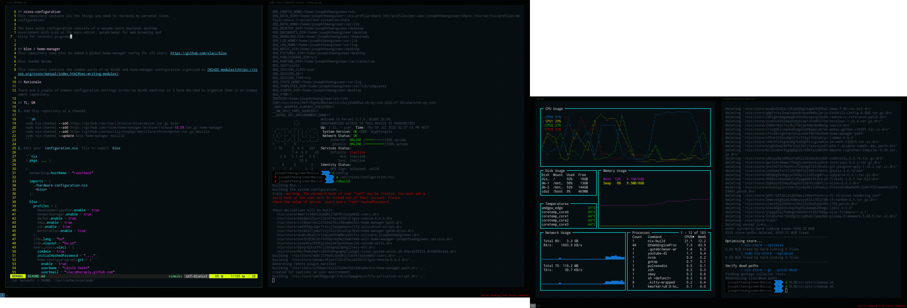

# git@git.theengineer.life:nixos-configuration
This repository contains all the things you need to recreate my personal nixos
configuration!

## Graphical setup
The base **machine/generic/graphical.nix** configuration consists of a swaywm (pure wayland) desktop
environment with nvim as the main editor, qutebrowser for web browsing and
kitty for terminal programs. The configuraton also supports multimonitor setups
with the use of the function keys as workspace buttons.



## Minimal server
The base **machine/generic/server.nix** provides config for a mail, git, irc,
website and pihole server.

## Raspberry Pi 4
*Coming soon!*


## blox / home-manager
This repository uses blox to embed a global home-manager config for all users. https://github.com/vlaci/blox

**Blox readme below:**

This repository contains the common parts of my NixOS and home-manager configuration organized as [NIxOS modules](https://nixos.org/nixos/manual/index.html#sec-writing-modules).

### Rationale

There are a couple of common configuration settings across my NixOS machines so I have decided to organize them in an independent repository

### TL; DR

1. Add this repository as a channel:

    ```sh
    sudo nix-channel --add https://github.com/vlaci/blox/archive/master.tar.gz blox
    sudo nix-channel --add https://github.com/rycee/home-manager/archive/release-18.09.tar.gz home-manager
    sudo nix-channel --add https://github.com/mozilla/nixpkgs-mozilla/archive/master.tar.gz mozilla
    sudo nix-channel --update blox home-manager mozilla
    ```

2. Edit your `configuration.nix` file to import `blox`

    ```nix
    { pkgs, ... }:

    {
      networking.hostName = "razorback";

      imports = [
        ./hardware-configuration.nix
         <blox>
      ];

      blox = {
        profiles = {
          development.python.enable = true;
          networkmanager.enable = true;
          docker.enable = true;
          tmux.enable = true;
          zsh.enable = true;
          workstation.enable = true;
        };
        i18n.lang = "hu";
        i18n.xlayout = "hu,us";
        users.users.vlaci = {
          isAdmin = true;
          initialHashedPassword = "....";
          home-config.programs.git = {
            enable = true;
            userName = "László Vaskó";
            userEmail = "vlaci@noreply.github.com";
          };
        };
      };

      blox.home-manager.config =
        { pkgs, ... }:
        {
          blox.profiles.keepass.enable = true;

          home.packages = with pkgs; [
            vscode
          ];
        }
      ;
    }
    ```

3. Rebuild NixOS

    ```sh
    $ sudo nixos-rebuild switch
    building Nix...
    building the system configuration...
    activating the configuration...
    setting up /etc...
    reloading user units for lightdm...
    reloading user units for vlaci...
    setting up tmpfiles
    ```

4. Profit

### [Configuration Reference](./doc/options.md)

The options can be viewed as man page too:

```sh
# if you have blox installed and `blox.blox.installDocs is enabled (the default):
man 5 blox-configuration

# otherwise:
man -l $(nix-build "<blox/doc>" -A man --no-out-link)
```
